# Lucas-Kanade (LK) Tracker

-----------------------

Regular LK tracker

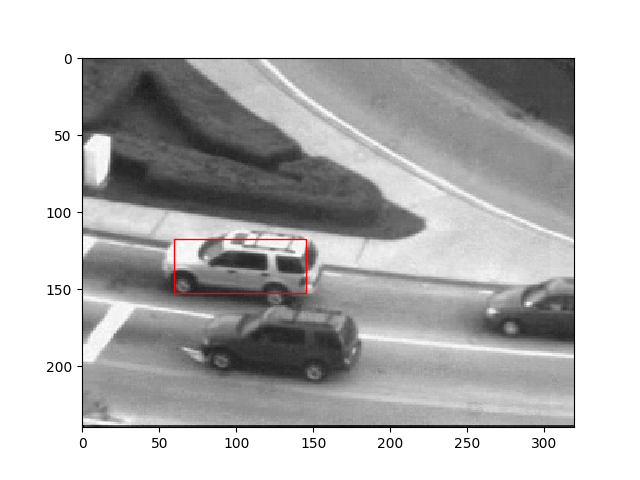 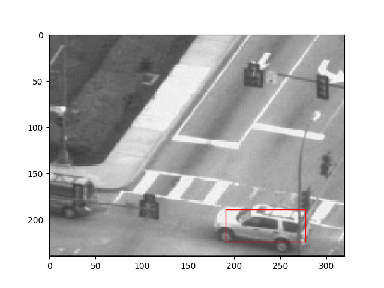 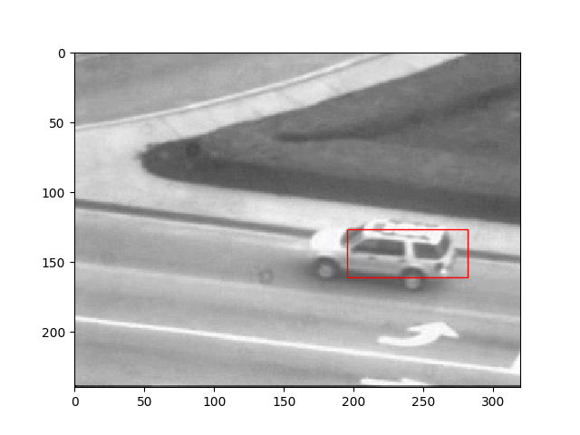  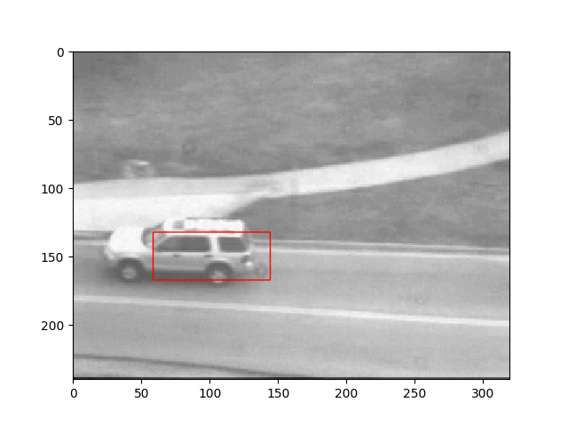

-----------------------

LK tracker with template correction to prevent drift

  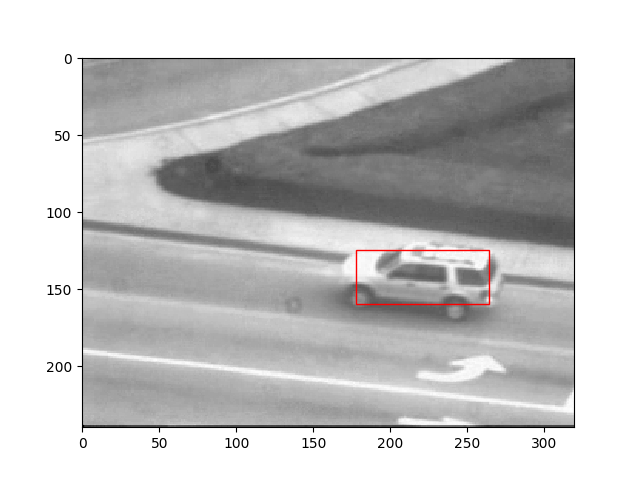 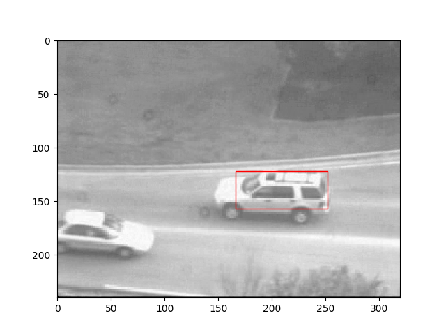 

-----------------------

Regular LK tracker (green box) and with appearance basis (yellow box)

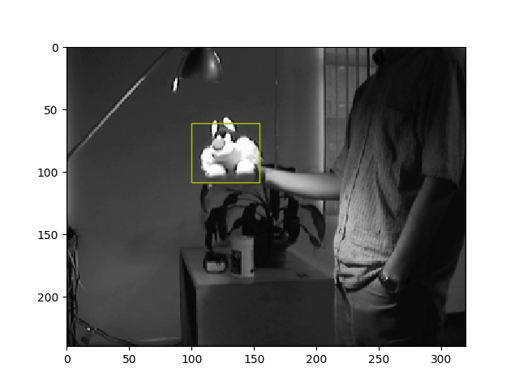 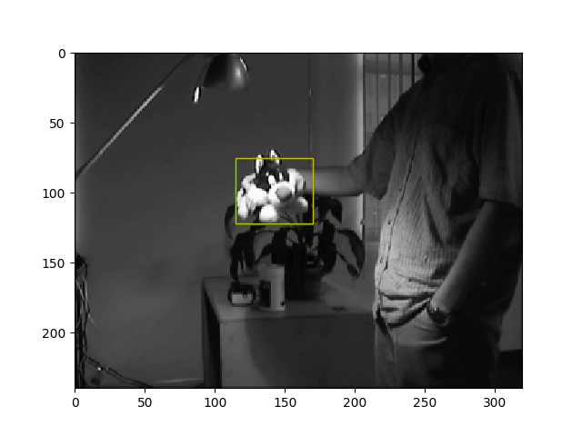 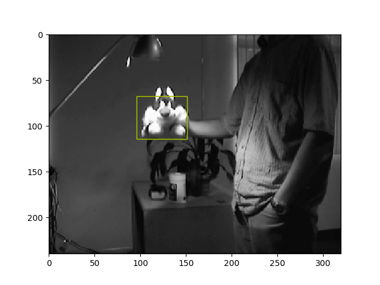 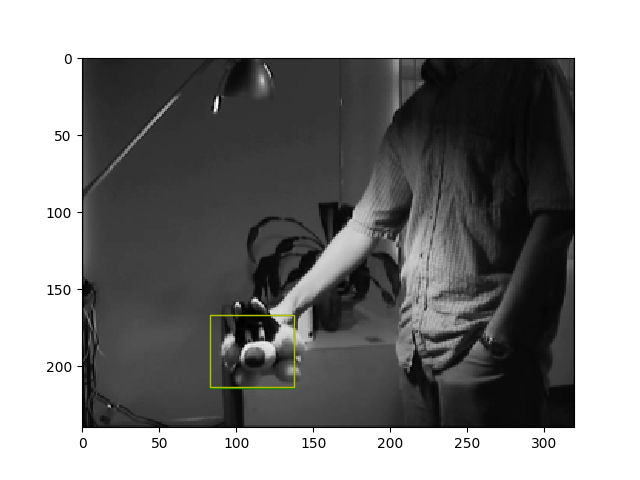 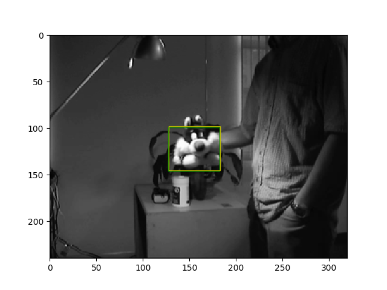

-----------------------

LK tracker for estimating dominant motion

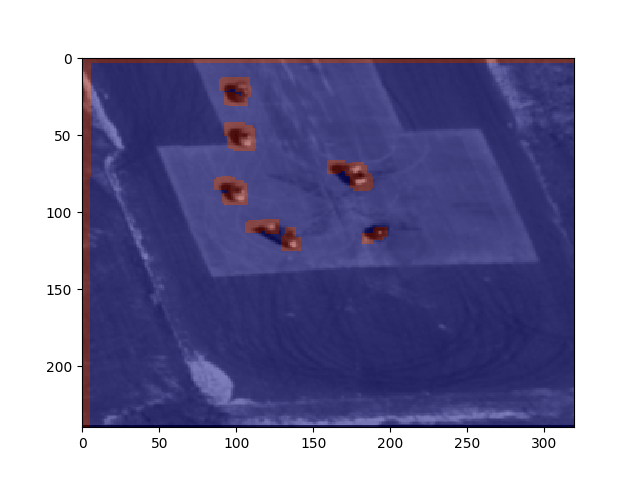 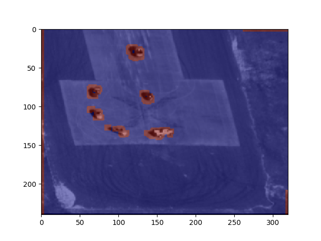 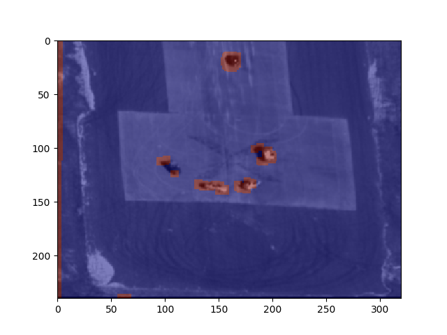 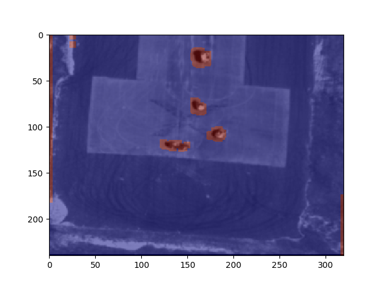

-----------------------